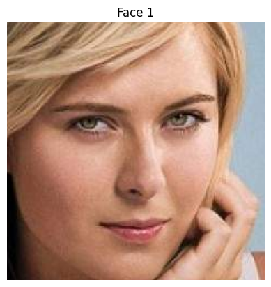
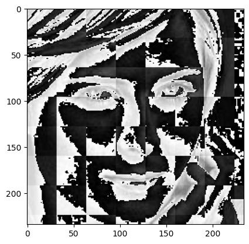

# Celebrity Face Recognition System

A full-stack Machine Learning web application that detects and classifies celebrity faces from uploaded images using Computer Vision and Machine Learning techniques.

The project uses:

- FastAPI backend
- Next.js + React frontend
- OpenCV Haar Cascades for face & eye detection
- Wavelet Transform for feature extraction
- Scikit-learn ML model for classification

---

# Features

- Upload celebrity images
- Face detection using OpenCV
- Eye detection validation
- Celebrity classification
- Confidence score prediction
- Modern responsive UI using Tailwind CSS
- Drag & drop image upload
- FastAPI REST API backend
- Real-time frontend integration

---

# Tech Stack

## Frontend
- Next.js
- React
- TypeScript
- Tailwind CSS

## Backend
- FastAPI
- Uvicorn

## Machine Learning / CV
- OpenCV
- NumPy
- Scikit-learn
- PyWavelets
- Joblib

---


# Backend Setup

## 1. Install Dependencies

```bash
pip install fastapi uvicorn python-multipart
pip install numpy opencv-python scikit-learn pywavelets joblib
```

## 3. Start Backend Server

Navigate to the server directory:

```bash
cd server
```

Run the FastAPI server:

```bash
python server.py
```

OR

```bash
uvicorn server:app --reload --port 5000
```

Backend will run on:

```bash
http://127.0.0.1:5000
```

FastAPI docs:

```bash
http://127.0.0.1:5000/docs
```

---

# Frontend Setup

## 1. Navigate to UI Folder

```bash
cd ui
```

## 2. Install Dependencies

```bash
npm install
```

## 3. Run Development Server

```bash
npm run dev
```

Frontend will run on:

```bash
http://localhost:3000
```

---

# API Endpoint

## Classify Image

### Endpoint

```bash
POST /classify_image
```

### Request

FormData:

```bash
img_data
```

### Response

```json
[
  {
    "class": "Brad Pitt",
    "confidence": 94.52
  }
]
```

---

# Machine Learning Pipeline

## Image Processing

1. Face detection using Haar Cascade
2. Eye detection validation
3. Cropping facial region
4. Resize image to 48x48
5. Wavelet transformation
6. Feature concatenation

# Wavelet Transformation Example

The model uses Wavelet Transformation for feature extraction before classification.

| Original Image | Wavelet Transformed Image |
|---|---|
|  |  |

The wavelet transformed image helps the model focus on important facial features and edge patterns, improving classification accuracy.

## Model Prediction

The processed image is passed into a trained Scikit-learn classification model which predicts:

- Celebrity name
- Confidence score

---

# Supported Celebrities

## Actors
- Angelina Jolie
- Scarlett Johansson
- Brad Pitt
- Jennifer Lawrence
- Johnny Depp
- Megan Fox
- Natalie Portman

## Sports Personalities
- Lionel Messi
- Maria Sharapova
- Roger Federer
- Serena Williams
- Virat Kohli

---

# Deployment

Deploy on:

- Render


